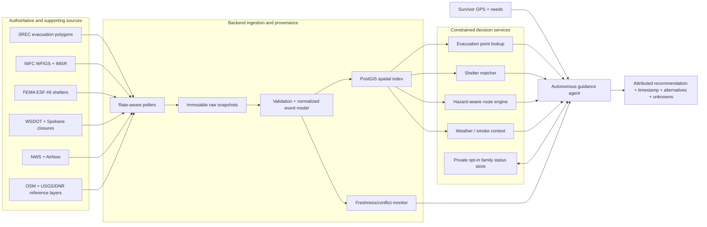

# Public Data Research for a Spokane Wildfire Survivor Agent

**Research date:** 10 August 2026; live-source refresh checked 11 August 2026 at approximately 00:30 Pacific time  
**Case study:** the 2026 Spokane-area wildfires  
**Scope:** research and source evaluation only; no application was built  
**Safety note:** this catalog is for designing a decision-support prototype. It is not a substitute for 911, official evacuation orders, incident command, or responder judgment.

## Executive summary

The proposed workflow is feasible as a strong hackathon demonstration, but only if each answer is time-stamped, source-attributed, and conservative about uncertainty. The strongest machine-readable chain is:

1. user GPS point;
2. point-in-polygon against the **Spokane Regional Emergency Communications (SREC) public evacuation FeatureServer**;
3. distance/intersection against **NIFC WFIGS current incident locations and perimeters**;
4. shelter selection from the **FEMA ESF #6 Shelter System**;
5. a locally hosted OpenStreetMap routing graph with edges removed or penalized using **SREC and WSDOT closures plus evacuation/fire polygons**;
6. **NWS API** forecasts and alerts, and **AirNow** AQI as context; and
7. a private, opt-in family check-in store rather than a public missing-person API.

The most important discovery is that SREC exposes its live evacuation polygons directly. The service is anonymous, queryable as GeoJSON, and includes incident name, Level 1/2/3, status, boundary text, and public instructions. Its public view deliberately excludes `All Clear` and pre-plan records. It does **not** expose a population count, so the agent must not infer an official number of evacuees from the number or area of polygons.

The current incident data also needs source discipline. The three August fires are often described collectively as the **Spokane Complex**, but official federal datasets still identify **Old Trails, Fairview, and Autumn Lane** separately. NIFC's 10 August morning report and later WFIGS edits on the same date have different containment values. That is normal operational revision, not a reason to silently choose one. A user-facing answer should say “as of” and cite the source and observation time.

### Best-source summary

| Tier | Need | Best source | Machine access | Why it is the best fit | Main limitation |
|---|---|---|---|---|---|
| **1** | Evacuation status | [SREC Evacuation Areas public view](https://services3.arcgis.com/9UdSzuxhN4jGcI9p/arcgis/rest/services/Evacuation_Areas_Spokane_County_Share_View/FeatureServer/0) | ArcGIS REST; JSON, GeoJSON, PBF | Local incident-command evacuation geometry and instructions | Beta/disclaimer; no exposed population count; all-clear filtered out |
| **1** | Fire location/perimeter/status | [NIFC WFIGS Current Perimeters](https://services3.arcgis.com/T4QMspbfLg3qTGWY/arcgis/rest/services/WFIGS_Interagency_Perimeters_Current/FeatureServer/0) and [Current Locations](https://services3.arcgis.com/T4QMspbfLg3qTGWY/ArcGIS/rest/services/WFIGS_Incident_Locations_Current/FeatureServer) | ArcGIS REST; JSON, GeoJSON, PBF, extract | National interagency/IRWIN working record; rich fields and geometry | Perimeters arrive only when incident GIS submits them; records age out |
| **1** | Official daily incident facts | [NIFC Incident Management Situation Report](https://www.nifc.gov/fire-information) | Daily PDF; predictable archive URLs | Official daily acreage, containment, losses, resources, narrative | PDF parsing; morning snapshot can be superseded later |
| **1** | Open shelters | [FEMA ESF #6 Shelter System](https://gis.fema.gov/arcgis/rest/services/NSS/FEMA_NSS/FeatureServer) | ArcGIS REST; JSON, GeoJSON, PBF | Open/full/closed layers and unusually rich facility/status fields | Many optional fields are null; no clear per-feature update field |
| **1** | State-highway closures | [WSDOT Road Alerts](https://data.wsdot.wa.gov/arcgis/rest/services/TravelInformation/TravelInfoRoadAlerts/FeatureServer/2) | ArcGIS REST; JSON, GeoJSON, PBF | Anonymous spatial closure lines from traffic management centers | State highways only; not a routing engine |
| **1** | Weather and warnings | [NWS API](https://www.weather.gov/documentation/services-web-api) | GeoJSON/JSON-LD; CAP/Atom for alerts | Official point forecast, hourly grid, wind, humidity, warnings | Forecast uncertainty; requires identifiable `User-Agent` |
| **2** | Local closure/response POIs | [SREC Evacuation Support Data](https://services3.arcgis.com/9UdSzuxhN4jGcI9p/arcgis/rest/services/Evacuation_Support_Data_Spokane_County_Public_View/FeatureServer) | ArcGIS REST | Can represent local road closures, shelters, and animal shelters | Returned no current features during this review; last edit appeared stale |
| **2** | Fire detections | [NASA FIRMS](https://firms.modaps.eosdis.nasa.gov/api/area/) | CSV/JSON/KML/SHP; WMS | Near-real-time VIIRS/MODIS/Landsat detections | Hotspots are not perimeters; map key and quotas |
| **2** | Air quality | [EPA AirNow API](https://docs.airnowapi.org/) | JSON/XML/CSV; bulk text files | Official public AQI reporting and forecasts | Preliminary, hourly data; API key; must follow display guidelines |
| **2** | Local roads | [Spokane County road closures](https://services.spokanegis.org/arcgis/rest/services/ICM/RoadClosures_OpenData/FeatureServer/0) | ArcGIS REST; JSON, GeoJSON, PBF | County/local closure linework, including Waze-oriented fields | Maintenance cadence and emergency completeness are undocumented |
| **2** | Routing network | [OpenStreetMap](https://www.openstreetmap.org/copyright) + self-hosted [OSRM](https://project-osrm.org/docs/v5.24.0/api/) | PBF/XML/Overpass; HTTP route service | Reproducible, configurable road graph | OSM may lag closures; public tile/router servers have no emergency SLA |
| **3** | Replay/final perimeters | [WFIGS all perimeters](https://services3.arcgis.com/T4QMspbfLg3qTGWY/arcgis/rest/services/WFIGS_Interagency_Perimeters/FeatureServer/0) and [WA DNR fire history](https://gis.dnr.wa.gov/site3/rest/services/Public_Wildfire/WADNR_PUBLIC_WD_WildFire_EGP_Portal/MapServer/3) | ArcGIS REST | Best/final historical geometry and attribution | Usually one best perimeter per fire, not daily progression |
| **3** | Local historical scenario | 2023 [Gray Fire](https://inciweb.wildfire.gov/incident-information/wanes-gray-fire) and [Oregon Fire](https://inciweb.wildfire.gov/incident-information/wanes-oregon-fire), plus OpenFEMA | Web pages, PDFs, APIs, GIS | Real Spokane County evacuation/recovery precedent | InciWeb has no documented public application API |

## 1. Actual 2026 Spokane wildfire events

### 1.1 Confirmed incidents and current operational snapshot

The following is a source reconciliation, not a single timeless truth. The daily NIFC report is an official morning snapshot. WFIGS can be edited later as incident data are synchronized.

| Incident | Official identifier / first report | Location in official reports | NIFC IMSR, 10 Aug 2026 | Later WFIGS attributes observed 10 Aug | Federal declaration |
|---|---|---|---|---|---|
| **Old Trails** | `2026-WANES-001845`; 1 Aug 2026, 11:59 a.m. local | About 3 miles west of Spokane | 3,176 acres; 53% contained; 557 personnel; 569 structures reported lost; estimated containment 15 Aug | 3,175.87 GIS acres; 3,176 incident acres; **73%** contained | [FM-5656-WA](https://www.fema.gov/disaster/5656), declared 1 Aug |
| **Fairview** | `2026-WANES-001852`; 1 Aug 2026, 2:12 p.m. local | About 5 miles north of Spokane | 992 acres; 53% contained; 114 personnel; 56 structures reported lost; estimated containment 15 Aug | 992.43 GIS acres; 992 incident acres; **97%** contained | [FM-5658-WA](https://www.fema.gov/disaster/5658), declared 2 Aug |
| **Autumn Lane** | `2026-WANES-001857`; 1 Aug 2026, 3:33 p.m. local | About 7 miles northwest of Spokane | 5,776 acres; 73% contained; 730 personnel; 149 structures reported lost; estimated containment 15 Aug | 5,763.77 GIS acres; 5,764 incident acres; **89%** contained | [FM-5659-WA](https://www.fema.gov/disaster/5659), declared 2 Aug; includes Spokane and Stevens counties |
| **Upriver** | `WA-NES`; 17 Jun 2026 | About 1 mile east of Spokane | 17 Jun: 230 acres, 10%, 247 personnel, 15 structures lost. By 20 Jun: 213 acres, 60%, 303 personnel, 18 structures lost | WA DNR later listed 213 acres and 100% contained | No incident-specific federal declaration found in OpenFEMA |

The 10 August report is the [NIFC IMSR for 10 August 2026](https://www.nifc.gov/sites/default/files/NICC/1-Incident%20Information/IMSR/2026/August/IMSR_CY26_08102026.pdf). It remained the latest verified daily PDF at the 11 August 00:30 Pacific refresh; an 11 August filename was not yet published and is therefore not cited. The Upriver progression appears in the official [17 June](https://www.nifc.gov/sites/default/files/NICC/1-Incident%20Information/IMSR/2026/June/IMSR_CY26_06172026_0_0.pdf), [18 June](https://www.nifc.gov/sites/default/files/NICC/1-Incident%20Information/IMSR/2026/June/IMSR_CY26_06182026_1.pdf), [19 June](https://www.nifc.gov/sites/default/files/NICC/1-Incident%20Information/IMSR/2026/June/IMSR_CY26_06192026_0.pdf), and [20 June](https://www.nifc.gov/sites/default/files/NICC/1-Incident%20Information/IMSR/2026/June/IMSR_CY26_06202026.pdf) reports. Local confirmation includes the [Spokane Police response](https://my.spokanecity.org/police/news/2026/06/17/spokane-police-assist-spokane-county-with-the-upriver-fire/) and [City Parks closure](https://my.spokanecity.org/parksrec/news/2026/06/17/upriver-fire-camp-sekani-update-06-17-26/).

All three August fires were also included in Washington's broader **EM-3650-WA Wildfires** emergency declaration, declared 3 August, with Spokane County among the designated areas. These records are queryable through OpenFEMA, described below.

### 1.2 What is and is not available

- **Names, ignition points, perimeters, acreage, discovery time, containment, cause, fuels, behavior, personnel, incident organization:** available in WFIGS; NIFC's daily PDF corroborates the operational headline fields.
- **Official evacuation zones and instructions:** available from SREC as live polygons.
- **Evacuation counts:** no authoritative count field was found in SREC's public evacuation layer, WFIGS, or OpenFEMA. An [Associated Press report](https://apnews.com/article/3738a2f795ca9cc0cca93eae76fb7ff0) gave an approximate count of 67,000 by 5 August; that is a secondary press estimate, not a machine-readable incident-command count. It should be displayed only as “reported estimate,” with date and source, or omitted.
- **Daily perimeter progression:** not guaranteed by WFIGS history. Current/YTD/full-history layers generally retain the current or best available perimeter. A replay service must archive its own snapshots and combine them with dated NIFC reports.
- **Damage:** NIFC IMSR “structures lost” is an incident-report field and can be revised. WFIGS did not provide the same loss count in the queried perimeter record.

## 2. Tier 1 — Core real-time data

### 2.1 SREC Evacuation Areas — primary evacuation source

**Organization and authority:** Spokane Regional Emergency Communications (SREC), working with incident command. The [public lookup application](https://srec911.maps.arcgis.com/apps/instant/lookup/index.html?appid=337af083184c474d9d9181bb44f957b0) describes itself as the official, authoritative evacuation application.  
**Official ArcGIS item:** [item metadata](https://www.arcgis.com/sharing/rest/content/items/337af083184c474d9d9181bb44f957b0?f=pjson) and [application configuration](https://www.arcgis.com/sharing/rest/content/items/337af083184c474d9d9181bb44f957b0/data?f=pjson).  
**FeatureServer:** [service](https://services3.arcgis.com/9UdSzuxhN4jGcI9p/arcgis/rest/services/Evacuation_Areas_Spokane_County_Share_View/FeatureServer) and [polygon layer 0](https://services3.arcgis.com/9UdSzuxhN4jGcI9p/arcgis/rest/services/Evacuation_Areas_Spokane_County_Share_View/FeatureServer/0).  
**Formats:** ArcGIS JSON, GeoJSON, PBF; service extract options also advertise CSV, shapefile, SQLite, GeoPackage, file geodatabase, KML, Excel, Parquet, and feature collection. Geometry is polygon in EPSG:4326.  
**Important fields:** `IncidentType`, `IncidentName`, `FireDistrict`, `EvacStatus`, `EvacLevel`, `BoundaryDesc`, `PublicAppMsg`, `ShortLabelID`, `OBJECTID`, `GlobalID`, and geometry. Coded levels include `01 Level 1 – Ready`, `02 Level 2 – Set`, `03 Level 3 – Go`, plus shelter-in-place/hazmat values. Status codes distinguish new, upgraded, downgraded, and remains.  
**Coverage/cadence:** Spokane County; event-driven. The app tells users to refresh every five minutes during active events. The service advertised a 120-second cache maximum during review.  
**Authentication/cost/use:** anonymous and free. No explicit open-data license grant was found on the item. Hackathon/public-information use appears reasonable with attribution and compliance with the disclaimer; obtain written terms before commercial production.  
**Reliability:** Tier 1/local authority, but the app is marked **BETA** and says data are approximate, dynamic, subject to revision, and should not be the sole basis for preserving life or property.  
**Agent use:** do point-in-polygon for a GPS coordinate, return the highest intersecting level, incident name, official message, source timestamp, and a link back to the map. Never downgrade an alert based only on absence from the public view.

The public layer's view definition excludes status values `999`, `100`, and `800`; therefore **All Clear (`100`) is intentionally absent**. Cache the last seen zone and require a positively sourced all-clear message before telling a user conditions have cleared.

At the 11 August 00:30 Pacific refresh, the public query returned six active polygons: two Level 3 “remains” polygons (one Old Trails and one Autumn) and four downgraded Level 1 polygons. This is an observation of the feed at that time, not a durable summary; applications must query the service live.

```text
# GPS point lookup
https://services3.arcgis.com/9UdSzuxhN4jGcI9p/arcgis/rest/services/Evacuation_Areas_Spokane_County_Share_View/FeatureServer/0/query
  ?geometry=-117.5,47.75
  &geometryType=esriGeometryPoint
  &inSR=4326
  &spatialRel=esriSpatialRelIntersects
  &outFields=IncidentName,EvacLevel,EvacStatus,BoundaryDesc,PublicAppMsg
  &returnGeometry=false
  &f=pjson

# All public live zones
.../0/query?where=1%3D1&outFields=IncidentName,EvacLevel,EvacStatus,BoundaryDesc,PublicAppMsg,ShortLabelID&returnGeometry=true&outSR=4326&f=geojson
```

The app's address search uses a proxied Spokane County address locator. Because that locator URL is app-proxied rather than a documented general-purpose service, the backend should geocode through a separately licensed provider or accept device GPS, then query the polygon layer directly.

### 2.2 NIFC WFIGS/IRWIN — current wildfire geometry and attributes

**Organization and authority:** National Interagency Fire Center (NIFC); the Wildland Fire Interagency Geospatial Services (WFIGS) working data are synchronized with IRWIN. [WFIGS overview](https://data-nifc.opendata.arcgis.com/pages/d6ef1367fadc4405b5f09c98e52ed972).  
**Endpoints:** [Current Perimeters service](https://services3.arcgis.com/T4QMspbfLg3qTGWY/arcgis/rest/services/WFIGS_Interagency_Perimeters_Current/FeatureServer), [layer 0](https://services3.arcgis.com/T4QMspbfLg3qTGWY/arcgis/rest/services/WFIGS_Interagency_Perimeters_Current/FeatureServer/0), and [Current Incident Locations](https://services3.arcgis.com/T4QMspbfLg3qTGWY/ArcGIS/rest/services/WFIGS_Incident_Locations_Current/FeatureServer). The current-locations [ArcGIS item](https://www.arcgis.com/home/item.html?id=bbc26d501daa4312a07659a9e547f388) documents IRWIN refresh behavior.  
**Formats:** ArcGIS JSON, GeoJSON, PBF and ArcGIS extract/download operations.  
**Important fields:** perimeter source/method/date and GIS acres (`poly_*`); incident size, discovery time, initial latitude/longitude, containment/control/out times, percent contained, fire behavior/cause/fuels, responsible units, personnel, complex name, IRWIN/FOR IDs, and `UniqueFireIdentifier` (`attr_*`).  
**Coverage/cadence:** United States/interagency. Incident locations are refreshed from IRWIN approximately every five minutes; perimeter timing depends on when incident GIS supplies geometry. Current-layer records age out under size/staleness rules documented in item metadata.  
**Authentication/cost/use:** anonymous and free. Federal public-information use and extraction are intended, but the ArcGIS item does not provide a universal commercial warranty; retain NIFC attribution and confirm terms for production redistribution.  
**Reliability:** Tier 1 for current interagency working data. It is not a guarantee that every fire has a perimeter, and “current” is not synonymous with ground truth at this second.  
**Agent use:** spatial risk context, distance to perimeter, incident status card, corroboration of the evacuation incident name, and change detection. Do not route merely outside the polygon: add an uncertainty buffer and obey evacuation/closure data.

```text
https://services3.arcgis.com/T4QMspbfLg3qTGWY/arcgis/rest/services/WFIGS_Interagency_Perimeters_Current/FeatureServer/0/query
  ?where=attr_IncidentName%20IN%20(%27OLD%20TRAILS%27,%27AUTUMN%20LANE%27,%27FAIRVIEW%27)
  &outFields=poly_IncidentName,poly_GISAcres,poly_PolygonDateTime,attr_IncidentSize,attr_PercentContained,attr_FireDiscoveryDateTime,attr_InitialLatitude,attr_InitialLongitude,attr_UniqueFireIdentifier,attr_ModifiedOnDateTime_dt
  &returnGeometry=true&outSR=4326&f=geojson
```

### 2.3 NIFC daily Incident Management Situation Report (IMSR)

**Organization:** NIFC/National Interagency Coordination Center.  
**Official URL:** [Fire information](https://www.nifc.gov/fire-information); [10 August 2026 report](https://www.nifc.gov/sites/default/files/NICC/1-Incident%20Information/IMSR/2026/August/IMSR_CY26_08102026.pdf).  
**Access/format:** public PDF; no API. Daily archive URLs are date-based but occasional filename suffixes mean a crawler should discover links rather than assume a filename.  
**Fields:** incident name/number, acres, daily change, containment, estimated containment date, personnel and resources, structures lost, cost, fuels, fire behavior, threats, evacuations/closures, and managing team.  
**Coverage/cadence:** national; normally daily during fire season.  
**Authentication/cost/use:** none/free. U.S. government publication; attribution is prudent. No operational warranty.  
**Reliability:** Tier 1 official daily summary.  
**Agent use:** source-of-record snapshot for narrative and damage/resource fields; OCR/text-extract into a dated event table; compare with later live edits rather than overwrite them without provenance.

### 2.4 FEMA ESF #6 Shelter System

**Organization:** FEMA Mass Care/Emergency Assistance; shelter information incorporates sheltering partners including the American Red Cross.  
**Endpoints:** [FeatureServer](https://gis.fema.gov/arcgis/rest/services/NSS/FEMA_NSS/FeatureServer), with layers `0 Open`, `1 Closed`, `2 Full`, and `3 Alert`; [MapServer](https://gis.fema.gov/arcgis/rest/services/NSS/FEMA_NSS/MapServer); [ArcGIS dataset item](https://www.arcgis.com/home/item.html?id=ae5879bb7e3c452cbe385d230639d680).  
**Formats:** ArcGIS JSON, GeoJSON, PBF; point geometry.  
**Fields available:**

| Requested field | Availability and caveat |
|---|---|
| Name/address/lat-long | Yes: shelter name, street, city, county, state, ZIP, geometry, latitude/longitude variants |
| Open/closed/full | Yes, represented by separate layers and incident-status fields |
| Capacity | `evacuation_capacity`, `post_impact_capacity`; often null |
| Current population | general, medical-needs, other, total and pet population fields; often null |
| ADA/wheelchair | coded `ada_compliant`, `wheelchair_accessible`; often `UNK` |
| Pets | accommodation code/description and pet population; distinguish service animals from household-pet sheltering |
| Medical support | a `medical_needs_population` count exists, but **does not prove clinical capability**; no dependable medical-services capability field was confirmed |
| Generator | `generator_onsite` and `self_sufficient_electricity`; often `UNK` |
| Contact | organization, main phone, email, hotline, POC, hours and facility contact fields |
| Last update | reporting/open/close dates exist; no consistently populated per-feature `last_updated` field was confirmed |

**Coverage/cadence:** United States; operational/event-driven.  
**Authentication/cost/use:** anonymous/free. Public FEMA/partner data, but dataset copyright/attribution applies; production/commercial terms should be confirmed.  
**Reliability:** Tier 1 for machine-readable shelter status, subject to partner reporting delays and null fields. Always call a listed shelter before directing a medically fragile user.  
**Agent use:** query open and full layers; hard-filter out full/closed; rank by safe-route travel time and explicit accommodations; render unknowns as unknown, never “No.”

At review time the Spokane County open query returned three sites: **Spokane Convention Center** (334 W Spokane Falls Blvd), **Outside-Spokane Fair & Expo** (404 N Havana St), and **North Spokane RV Campground** (10904 N Newport Hwy). Capacity/current population were null, and accessibility/generator fields were unknown; this is a good example of why matching must tolerate sparse records.

```text
https://gis.fema.gov/arcgis/rest/services/NSS/FEMA_NSS/FeatureServer/0/query
  ?where=state%3D%27WA%27%20AND%20county_parish%3D%27Spokane%27
  &outFields=*&returnGeometry=true&outSR=4326&f=geojson
```

### 2.5 WSDOT road alerts and Traveler Information API

**Organization:** Washington State Department of Transportation (WSDOT).  
**Anonymous spatial endpoint:** [TravelInfoRoadAlerts FeatureServer](https://data.wsdot.wa.gov/arcgis/rest/services/TravelInformation/TravelInfoRoadAlerts/FeatureServer), especially [Road Closures layer 2](https://data.wsdot.wa.gov/arcgis/rest/services/TravelInformation/TravelInfoRoadAlerts/FeatureServer/2).  
**Authenticated API:** [Traveler Information API landing page](https://www.wsdot.wa.gov/traffic/api/), [Highway Alerts documentation](https://wsdot.wa.gov/traffic/api/Documentation/group___highway_alerts.html), and [REST operation list](https://wsdot.wa.gov/traffic/api/HighwayAlerts/HighwayAlertsREST.svc/Help).  
**Formats:** FeatureServer JSON/GeoJSON/PBF; Traveler API JSON, XML, RSS and KML.  
**Fields:** spatial layer includes route/road, direction, category/type, priority, headline, last-modified date and closed flag. Traveler API adds alert ID, county, start/end roadway locations and times, extended description, status, region and priority.  
**Coverage/cadence:** Washington state highways, current as reported by traffic management centers; event-driven.  
**Authentication/cost/use:** FeatureServer queries are anonymous/free. The Traveler API requires a free access code obtained by email. WSDOT terms/warranty should be reviewed before commercial launch; hackathon use with attribution appears intended.  
**Reliability:** Tier 1 for state highways, not city/county roads.  
**Agent use:** close graph edges intersecting closure lines; expose headline and last-update; require a second local source for county roads.

```text
# Spatial closure query around Spokane
https://data.wsdot.wa.gov/arcgis/rest/services/TravelInformation/TravelInfoRoadAlerts/FeatureServer/2/query
  ?geometry=-117.75,47.50,-117.05,48.05
  &geometryType=esriGeometryEnvelope&inSR=4326
  &spatialRel=esriSpatialRelIntersects
  &outFields=Road,RoadDirection,HeadlineMessage,LastModifiedDate,RoadClosedFlag
  &returnGeometry=true&outSR=4326&f=geojson

# Keyed REST operation
https://wsdot.wa.gov/Traffic/api/HighwayAlerts/HighwayAlertsREST.svc/GetAlertsAsJson?AccessCode={ACCESS_CODE}
```

### 2.6 National Weather Service API and fire-weather products

**Organization:** NOAA/National Weather Service.  
**Documentation:** [NWS API](https://www.weather.gov/documentation/services-web-api) and [alerts service](https://www.weather.gov/documentation/services-web-alerts).  
**Endpoints:** `https://api.weather.gov/points/{lat},{lon}`, links returned from that response, and `https://api.weather.gov/alerts/active?point={lat},{lon}`. For downtown Spokane, the verified point response maps to office `OTX`, grid `140,90`, fire zone `WAZ708`, hourly forecast `https://api.weather.gov/gridpoints/OTX/140,90/forecast/hourly`, and raw grid `https://api.weather.gov/gridpoints/OTX/140,90`. The [OTX Fire Weather Planning Forecast](https://forecast.weather.gov/product.php?format=CI&glossary=1&issuedby=OTX&product=FWF&site=OTX&version=1) is useful human-readable context.  
**Formats:** GeoJSON/JSON-LD; alerts are also available as CAP and Atom.  
**Fields:** temperature, dewpoint, relative humidity, wind speed/direction/gust, precipitation, sky/visibility, detailed forecast, alert severity/urgency/certainty/effective/expires/area/description/instruction.  
**Coverage/cadence:** United States; forecasts and alerts update operationally. Poll alerts no more often than the official guidance (30 seconds is the documented floor); ordinary applications should cache more conservatively.  
**Authentication/cost/use:** no key/free; send an identifiable `User-Agent`. U.S. government public data; no warranty.  
**Reliability:** Tier 1 official weather/warning data.  
**Agent use:** explain wind/fire-weather context, prioritize routes/shelters away from likely smoke or downwind exposure, and show Red Flag Warnings. Do not calculate a fire-spread prediction from ordinary forecast fields.

```text
https://api.weather.gov/points/47.6588,-117.4260
https://api.weather.gov/gridpoints/OTX/140,90/forecast/hourly
https://api.weather.gov/alerts/active?point=47.6588,-117.4260
```

## 3. Tier 2 — Supporting operational data

### 3.1 Washington DNR wildfire portal and GIS services

**Organization:** Washington State Department of Natural Resources (WA DNR).  
**Official pages:** [Current wildfire incident information](https://dnr.wa.gov/wildfire-resources/current-wildfire-incident-information) and [Wildfire Portal](https://dnr.wa.gov/wildfire-resources/current-wildfire-incident-information/wildfire-portal).  
**GIS services:** [Wildfire EGP Portal MapServer](https://gis.dnr.wa.gov/site3/rest/services/Public_Wildfire/WADNR_PUBLIC_WD_WildFire_EGP_Portal/MapServer), [Wildfire Data MapServer](https://gis.dnr.wa.gov/site3/rest/services/Public_Wildfire/WADNR_PUBLIC_WD_WildFire_Data/MapServer), [WUI MapServer](https://gis.dnr.wa.gov/site3/rest/services/Public_Wildfire/WADNR_PUBLIC_WD_WUI/MapServer), and [LANDFIRE-derived MapServer](https://gis.dnr.wa.gov/site3/rest/services/Public_Wildfire/WADNR_PUBLIC_LandFire/MapServer).  
**Formats:** ArcGIS MapServer query/identify/export; queryable vector layers advertise JSON, GeoJSON and PBF.  
**Fields/layers:** current DNR fire-statistics points; final large-fire perimeters; fire name/number, discovery/perimeter date, acres, cause and year; county/fire-district/dispatch boundaries; fire danger and Industrial Fire Precaution Level; 2019 WUI classes; 30 m vegetation/fire-regime rasters.  
**Coverage/cadence:** Washington; current layers are operational/event-driven, danger/IFPL can update daily in season, while WUI/LANDFIRE/history are periodic/static.  
**Authentication/cost/use:** anonymous/free. State public data with DNR attribution; no blanket commercial license statement was located, so confirm production redistribution terms.  
**Reliability:** Tier 2 corroboration for live incidents and excellent state context. WFIGS is preferred for national current geometry. During review, the DNR web portal's display lagged later federal updates and contained some apparently inconsistent date values, so ingest the GIS layer rather than screen-scraping its table and retain source timestamps.  
**Agent use:** confirm DNR protection/jurisdiction, fire danger, WUI exposure, and state historical context.

```text
# DNR current fire-statistics points (layer 1)
https://gis.dnr.wa.gov/site3/rest/services/Public_Wildfire/WADNR_PUBLIC_WD_WildFire_Data/MapServer/1/query
  ?where=1%3D1&outFields=*&returnGeometry=true&outSR=4326&f=geojson

# WUI identify/query source
https://gis.dnr.wa.gov/site3/rest/services/Public_Wildfire/WADNR_PUBLIC_WD_WUI/MapServer/0
```

### 3.2 OpenFEMA declarations — official federal status, not live fire behavior

**Organization:** FEMA.  
**Documentation:** [Disaster Declarations Summaries](https://www.fema.gov/about/openfema/disaster-declarations-summaries) and [OpenFEMA](https://www.fema.gov/about/reports-and-data/openfema).  
**Endpoint:** `https://www.fema.gov/api/open/v2/DisasterDeclarationsSummaries`. Full JSON/CSV downloads are also available.  
**Formats/fields:** JSON, JSONA, CSV; FEMA declaration string/number, type, title, incident type and dates, state/county/designated area, program flags, declaration/request IDs, last refresh and record hash.  
**Coverage/cadence:** national, 1953-present; metadata documents a nominal 20-minute refresh interval.  
**Authentication/cost/use:** no registration/free; FEMA states the API follows open standards. Government public-data use is intended; retain attribution and do not imply grant eligibility for individuals from an FMAG record.  
**Reliability:** Tier 2 for official federal declaration status; not an evacuation or perimeter feed.  
**Agent use:** confirm federal declarations and recovery context, build a historical event index, and link to official assistance pages.

Verified 2026 records include `FM-5656-WA` Old Trails, `FM-5658-WA` Fairview, `FM-5659-WA` Autumn Lane, and `EM-3650-WA` Wildfires. FMAG public assistance primarily supports eligible government firefighting costs; its existence does not mean Individual Assistance is available.

```text
https://www.fema.gov/api/open/v2/DisasterDeclarationsSummaries
  ?$filter=state%20eq%20%27WA%27%20and%20fyDeclared%20eq%202026
  &$top=100
```

### 3.3 SREC Evacuation Support Data

**Organization:** SREC.  
**Item/service:** [ArcGIS item](https://www.arcgis.com/sharing/rest/content/items/c09813bf9d1a41038ef1423ca8f65a98?f=pjson) and [FeatureServer](https://services3.arcgis.com/9UdSzuxhN4jGcI9p/arcgis/rest/services/Evacuation_Support_Data_Spokane_County_Public_View/FeatureServer).  
**Useful layers:** `2 Evacuation POI` (point) and `3 Evacuation Road Closure` (polyline).  
**Formats/fields:** ArcGIS JSON/GeoJSON/PBF. POI fields include type (road closure, shelter, animal shelter), name, notes, address and phone. Closure fields include road name, active flag and notes.  
**Coverage/cadence:** Spokane County/event-driven; no dependable published interval.  
**Authentication/cost/use:** anonymous/free; no explicit open license, approximate-data disclaimer applies.  
**Reliability:** Tier 2. Both useful queries returned zero features on 10 August even though evacuation polygons were active, and the service's visible data edit appeared to predate the August complex. Treat it as supplemental unless an on-call test confirms current incident-command usage.  
**Agent use:** local shelter/animal-shelter and closure enrichment when populated.

```text
.../FeatureServer/2/query?where=1%3D1&outFields=*&returnGeometry=true&outSR=4326&f=geojson
.../FeatureServer/3/query?where=ActiveClosure%3D1&outFields=RoadName,Notes&returnGeometry=true&outSR=4326&f=geojson
```

### 3.4 Spokane County road closures

**Organization:** Spokane County GIS/Public Works.  
**Endpoint:** [Road Closures FeatureServer layer 0](https://services.spokanegis.org/arcgis/rest/services/ICM/RoadClosures_OpenData/FeatureServer/0); a parallel MapServer exists at the same service path.  
**Formats/fields:** ArcGIS JSON, GeoJSON, PBF and extract. Fields include incident ID, `Type`, `SubType`, direction, street, start/end time, description, contact, permit ID and comments; Waze-compatible coded values include `ROAD_CLOSED`. Geometry is polyline.  
**Coverage/cadence:** Spokane County; maintenance/event-driven, but no explicit update SLA was found.  
**Authentication/cost/use:** anonymous/free; no explicit commercial license text found. Confirm production terms and attribution.  
**Reliability:** Tier 2 because it is an official local source but its emergency completeness and refresh cadence are undocumented.  
**Agent use:** close local road edges not covered by WSDOT and cross-check SREC lines.

```text
https://services.spokanegis.org/arcgis/rest/services/ICM/RoadClosures_OpenData/FeatureServer/0/query
  ?where=Type%3D%27ROAD_CLOSED%27
  &outFields=IncidentID,Street,Direction,StartTime,EndTime,Description,Contact
  &returnGeometry=true&outSR=4326&f=geojson
```

### 3.5 NASA FIRMS active-fire detections

**Organization:** NASA Fire Information for Resource Management System (FIRMS).  
**Documentation:** [active-fire data](https://firms.modaps.eosdis.nasa.gov/active_fire/), [Area API](https://firms.modaps.eosdis.nasa.gov/api/area/), [WMS](https://firms.modaps.eosdis.nasa.gov/mapserver/wms-info/), and [archive downloads](https://firms.modaps.eosdis.nasa.gov/download/).  
**Formats/endpoints:** Area API CSV (and other API products), downloadable SHP/CSV/JSON/KML, and OGC WMS. The verified pattern is `/api/area/csv/[MAP_KEY]/[SOURCE]/[west,south,east,north]/[DAY_RANGE]`, optionally followed by a date.  
**Fields:** latitude, longitude, acquisition date/time, satellite/instrument, confidence, brightness/temperature, fire radiative power, day/night and source version.  
**Coverage/cadence:** global. NRT is generally available in under three hours and often under one hour; FIRMS describes ultra-real-time availability for the United States/Canada that can be under a minute. WMS refreshes approximately every 15 minutes. Actual availability depends on satellite overpass, clouds and processing.  
**Authentication/cost/use:** free map key requested by email; documented limit is 5,000 transactions per ten minutes. NASA Earth science data are broadly reusable, but users must follow dataset-specific citation/terms. Archive downloads may require Earthdata/email authentication.  
**Reliability:** Tier 2 detection signal, **not** an evacuation or perimeter authority.  
**Agent use:** flag new thermal activity near a route, show directionally useful context, and detect that a mapped perimeter may be stale. Never describe every detection as a wildfire or infer a safe boundary from absence of detections.

```text
https://firms.modaps.eosdis.nasa.gov/api/area/csv/{MAP_KEY}/VIIRS_NOAA20_NRT/-117.9,47.4,-117.0,48.1/1
```

### 3.6 EPA AirNow

**Organization:** U.S. EPA AirNow, with federal/state/local/tribal partners.  
**Documentation:** [API overview](https://docs.airnowapi.org/about), [web services](https://docs.airnowapi.org/webservices), [FAQ/rate limits](https://docs.airnowapi.org/faq), [data-use guidelines](https://docs.airnowapi.org/docs/DataUseGuidelines.pdf), and [Fire and Smoke Map](https://fire.airnow.gov/?aqi_v=1).  
**Endpoint/formats:** keyed web services return JSON, XML or CSV; national file products are browsable at `https://files.airnowtech.org/?prefix=airnow/today/`. A documented current-observations pattern is:

```text
https://www.airnowapi.org/aq/observation/latLong/current/
  ?format=application/json&latitude=47.6588&longitude=-117.4260
  &distance=25&API_KEY={API_KEY}
```

**Fields:** observation date/hour, local time zone, reporting area/station, latitude/longitude, pollutant, concentration where applicable, AQI and category; forecast services add issue date, valid date, discussion and action-day fields.  
**Coverage/cadence:** United States plus participating Canada/Mexico sources. Observations update hourly and are commonly available 10–30 minutes after the hour; forecasts are generally daily. File feeds can refresh several times per hour.  
**Authentication/cost/use:** free public account/API key. Each service has an hourly cap; cache results and use bulk files for broad ingestion. Use is conditioned on the AirNow Data Use Guidelines, attribution, unaltered official AQI/advisory values and disclosure that observations are preliminary.  
**Reliability:** Tier 2 operational health context. Regulatory/validated analysis must use AQS, not AirNow.  
**Agent use:** filter/rank shelters by smoke exposure and provide official AQI health messaging. Do not make independent medical claims.

### 3.7 NOAA fire-weather and smoke-model layers

**Organizations:** NOAA Storm Prediction Center (SPC), NCEP and Global Systems Laboratory.  
**SPC service:** [SPC Fire Weather MapServer](https://mapservices.weather.noaa.gov/vector/rest/services/fire_weather/SPC_firewx/MapServer); [GIS downloads](https://www.spc.noaa.gov/gis/).  
**HRRR smoke:** [HRRR information](https://rapidrefresh.noaa.gov/hrrr/), [NOMADS HRRR files](https://nomads.ncep.noaa.gov/pub/data/nccf/com/hrrr/prod/), and the [NOAA HRRR open archive on AWS](https://registry.opendata.aws/noaa-hrrr-pds/).  
**Formats/fields:** SPC queryable ArcGIS vectors/shapefiles for Day 1/2 and longer fire-weather outlook categories and dry-thunderstorm areas. HRRR is GRIB2/OPeNDAP/cloud objects with hourly 3 km forecast grids, including near-surface and vertically integrated smoke and standard weather fields.  
**Coverage/cadence:** CONUS; SPC outlooks update on their issuance schedule; HRRR is hourly and selected cycles extend to 48 hours.  
**Authentication/cost/use:** anonymous/free U.S. government data; AWS bucket permits unsigned reads. Avoid scraping GSL graphics—the site explicitly warns automated scrapers—and retrieve model files from NOMADS/cloud archives.  
**Reliability:** Tier 2 predictive context. Smoke output is a model, not an observation; SPC outlooks are broad risk areas, not incident spread polygons.  
**Agent use:** rank alternate routes/shelters using forecast smoke and wind only as a soft penalty, display forecast horizon, and never present it as a guaranteed safe corridor.

### 3.8 American Red Cross shelter finder and survivor services

**Organization:** American Red Cross.  
**Public UI:** [Find an Open Shelter](https://www.redcross.org/get-help/disaster-relief-and-recovery-services/find-an-open-shelter.html?lv=true).  
**Format/API:** interactive web map; no documented public application API was found. The page notes that most, but not necessarily every, open shelter appears and may include partner-operated locations.  
**Fields/coverage/cadence:** displayed sites provide location/status information and survivor-service guidance, including disability accommodation and pets/service animals. Nationwide and event-driven.  
**Authentication/cost/use:** public/free human use. Automated scraping, redistribution and commercial terms are not granted; do not scrape without permission.  
**Reliability:** Tier 2 human cross-check and authoritative service provider; use FEMA ESF #6 for machine access.  
**Agent use:** deep-link a user to current Red Cross guidance and use the phone/contact workflow when FEMA fields are unknown.

### 3.9 OpenStreetMap and an evacuation-aware routing engine

**Organizations:** OpenStreetMap Foundation/community; OSRM is an open-source routing project.  
**Data/access:** [OSM copyright/license](https://www.openstreetmap.org/copyright), [Overpass API](https://wiki.openstreetmap.org/wiki/Overpass_API), [Nominatim policy](https://operations.osmfoundation.org/policies/nominatim/), [tile policy](https://operations.osmfoundation.org/policies/tiles/), and [OSRM HTTP API](https://project-osrm.org/docs/v5.24.0/api/).  
**Formats/fields:** OSM XML/PBF/Overpass JSON; nodes/ways/relations with `highway`, access, one-way, surface, bridge/tunnel and POI tags. OSRM returns JSON routes, legs, steps, geometry, distance and duration.  
**Coverage/cadence:** global; community updates range from minutes to much longer. Public Overpass/Nominatim/demo routers are best-effort.  
**Authentication/cost/use:** data are free under ODbL, including commercial use, with attribution and share-alike obligations for derivative databases. Public Nominatim is limited to one request/second and prohibits bulk geocoding/autocomplete. Public OSM tiles prohibit bulk/offline use and have no SLA. Self-host or contract a provider for production.  
**Reliability:** Tier 2 base network, never an official live-closure feed.  
**Agent use:** build and self-host a Spokane graph. Before routing, remove edges intersecting active SREC Level 3 polygons and official closure lines; heavily penalize Level 2, current WFIGS perimeter plus a configurable uncertainty buffer, and smoke/Level 1 areas. Return two alternatives, sources and freshness, and tell the user to obey responders and barricades.

OSRM's ordinary public `exclude` parameter does not accept arbitrary polygons. Hazard avoidance therefore needs preprocessing/custom graph weights (or another routing engine with custom models), followed by independent geometry validation of the returned route.

### 3.10 PurpleAir — optional sensor detail

**Organization:** PurpleAir.  
**API:** `https://api.purpleair.com/v1/sensors`; [API introduction](https://community.purpleair.com/t/about-the-purpleair-api/7145), [usage guidance](https://community.purpleair.com/t/api-use-guidelines/1589), [license](https://www2.purpleair.com/pages/license), and [attribution](https://www2.purpleair.com/pages/attribution).  
**Formats/fields:** JSON; sensor index/name/location, last seen, PM2.5 channel values, humidity/temperature, confidence and calculated fields.  
**Coverage/cadence:** global participating consumer sensors; sensors report roughly every two minutes.  
**Authentication/cost/use:** read key required; points-based billing with a starter allocation, not reliably free at scale. Licenses differ by use (including commercial) and attribution is required. Current terms should be reviewed carefully before redistribution.  
**Reliability:** Tier 2 optional community-sensor input. It is useful for spatial granularity but can be miscalibrated, indoors, offline or locally biased.  
**Agent use:** display as a clearly labeled supplemental sensor layer; prefer AirNow for public health messaging and apply an accepted correction only with documentation.

### 3.11 InciWeb and official local web updates

**Organizations:** interagency incident teams/NIFC for InciWeb; Spokane County/City for local releases.  
**URLs:** [InciWeb](https://inciweb.wildfire.gov/), [Spokane County Emergency Management](https://www.spokanecounty.gov/5498/Emergency-Management), and [Alert Center](https://www.spokanecounty.gov/alertcenter.aspx).  
**Format/API:** public HTML, incident updates, maps and attachments. No stable, documented public InciWeb API was found in this research; do not invent or depend on an internal endpoint. County CivicAlerts offers pages/archives but not a documented comprehensive GIS API.  
**Fields/coverage/cadence:** narrative situation, closures, contacts, photos/maps and preparedness notices; event-driven.  
**Authentication/cost/use:** public/free human access. Automated/commercial reuse terms are unclear; link and quote minimally rather than scraping wholesale.  
**Reliability:** Tier 2 official narrative source. Incidents may not have an InciWeb page, and local releases can be less current than SREC geometry.  
**Agent use:** retrieval-augmented explanations and direct links, after the structured feeds have determined status.

## 4. Geospatial reference layers

These are supporting layers, not real-time emergency authorities. Prefer local data where it has a clearly maintained feature, then use national sources for a consistent fallback.

| Tier | Feature | Source and endpoint | Format / key fields | Coverage / cadence | Auth, cost, use | Agent use and caveat |
|---|---|---|---|---|---|---|
| 2 | County, city, fire districts, parks, school districts | Spokane County [OpenData Boundary MapServer](https://gismo.spokanecounty.org/arcgis/rest/services/OpenData/Boundary/MapServer) | ArcGIS REST; polygons; names/IDs | Spokane County; periodic | Anonymous/free; local public-data terms not explicit—attribute and confirm commercial reuse | Local clipping, jurisdiction and district labels; do not infer individual school sites from a district polygon |
| 2 | State/county boundaries and hydrology | U.S. Census [TIGERweb REST directory](https://tigerweb.geo.census.gov/tigerwebmain/TIGERweb_restmapservice.html), including `State_County`, `Hydro`, `School`, and `Transportation` MapServers | ArcGIS REST/WMS; JSON geometry and Census IDs/names; downloadable TIGER/Line shapefiles | United States; annual/vintage releases | Anonymous/free U.S. government data | Stable base boundaries, water bodies and fallback roads; not live and not optimized for vehicle routing |
| 2 | Roads and emergency/community POIs | OpenStreetMap Overpass or a regional PBF extract | PBF/XML/JSON; road and amenity tags such as `hospital`, `fire_station`, `police`, `school`, `community_centre` | Global; community-maintained | ODbL, free with attribution/share-alike | One consistent base for routing and POI discovery; validate critical destinations against the facility's official site |
| 2 | Open and emergency shelters | FEMA ESF #6 layers and SREC support layer 2 | Point JSON/GeoJSON; shelter status and capability fields | National/local; event-driven | See source dossiers | Use FEMA as operational source; do not substitute an ordinary community center for an activated shelter |
| 2 | Wildland-urban interface | WA DNR [WUI MapServer](https://gis.dnr.wa.gov/site3/rest/services/Public_Wildfire/WADNR_PUBLIC_WD_WUI/MapServer/0) | Polygon MapServer; 2019 WUI class/structure-density context | Washington; static/periodic | Anonymous/free; DNR attribution; commercial terms not explicit | Explain long-term exposure, not current evacuation risk |
| 2 | Fuels/vegetation/fire regime | WA DNR [LANDFIRE MapServer](https://gis.dnr.wa.gov/site3/rest/services/Public_Wildfire/WADNR_PUBLIC_LandFire/MapServer) or national [LANDFIRE downloads/services](https://landfire.gov/help) | 30 m raster services/downloads; canopy, vegetation, surface/canopy fuels, fire regime | United States; periodic editions | Free federal data; cite product/version | Modeling and scenario features; too static to decide a route by itself |
| 2 | Terrain/elevation/slope | USGS [3DEP Elevation ImageServer](https://elevation.nationalmap.gov/arcgis/rest/services/3DEPElevation/ImageServer) and [EPQS explanation](https://www.usgs.gov/faqs/how-accurate-are-elevations-generated-elevation-point-query-service-national-map) | ArcGIS ImageServer, WMS/WCS; DEM pixel/elevation, derived slope/hillshade | United States; periodic source updates | Anonymous/free U.S. government data | Route-grade/slope, terrain display and fire-behavior context; not a spread model |
| 2 | Suppression difficulty/control context | WA DNR [POD Project Data MapServer](https://gis.dnr.wa.gov/site3/rest/services/Public_Wildfire/POD_Project_Data/MapServer) | Raster MapServer; potential control locations and suppression difficulty | Washington; 2021 planning product | Public-information category; free/anonymous; attribute DNR/OSU | Expert/planning context only; not public evacuation guidance |

Hospitals, fire stations, police stations, schools and community centers do not have to come from a single emergency feed. For the demo, seed POIs from an OSM regional extract, then validate the small number of surfaced destinations against official facility websites. HIFLD and commercial map providers may add coverage, but no currently documented, stable, anonymous HIFLD endpoint was verified in this research, so none is listed as a required dependency.

## 5. Tier 3 — Historical, fallback and simulation data

### 5.1 WFIGS year-to-date and full-history perimeters

**Organization:** NIFC.  
**Endpoints:** [Year-to-Date layer 0](https://services3.arcgis.com/T4QMspbfLg3qTGWY/arcgis/rest/services/WFIGS_Interagency_Perimeters_YearToDate/FeatureServer/0) and [all perimeters layer 0](https://services3.arcgis.com/T4QMspbfLg3qTGWY/arcgis/rest/services/WFIGS_Interagency_Perimeters/FeatureServer/0).  
**Formats/fields:** JSON, GeoJSON, PBF, extract; essentially the same rich `poly_*`/`attr_*` schema as current WFIGS.  
**Coverage/cadence:** national. IRWIN-derived working data begin around 2014, while NIFC is progressively connecting older perimeters to certified Fire Occurrence Data Records.  
**Authentication/cost/use:** anonymous/free; federal attribution and service disclaimer apply; confirm redistribution terms.  
**Reliability:** Tier 3 for replay. These layers represent the best available perimeter for an incident, **not an immutable sequence of every submitted perimeter**.  
**Agent use:** final geometry, incident index, synthetic snapshots and regression tests.

```text
https://services3.arcgis.com/T4QMspbfLg3qTGWY/arcgis/rest/services/WFIGS_Interagency_Perimeters_YearToDate/FeatureServer/0/query
  ?where=attr_POOState%3D%27US-WA%27%20AND%20attr_POOCounty%3D%27Spokane%27
  &outFields=*&returnGeometry=true&outSR=4326&f=geojson
```

Field values should first be inspected before using the sample filter—some vintages encode state/county differently. A robust loader should query schema/domains and fall back to a Spokane bounding box.

### 5.2 WA DNR fire history and statistics

**Organization:** WA DNR.  
**Endpoints:** [Washington Large Fires 1973–2025, layer 0](https://gis.dnr.wa.gov/site3/rest/services/Public_Wildfire/WADNR_PUBLIC_WD_WildFire_Data/MapServer/0), [Fire History 1973–present, layer 3](https://gis.dnr.wa.gov/site3/rest/services/Public_Wildfire/WADNR_PUBLIC_WD_WildFire_EGP_Portal/MapServer/3), [DNR Statistics 2008–present, layer 2](https://gis.dnr.wa.gov/site3/rest/services/Public_Wildfire/WADNR_PUBLIC_WD_WildFire_Data/MapServer/2), and older statistics layer 3 in the same service.  
**Formats/fields:** JSON/GeoJSON/PBF; final perimeter polygon fields include agency, fire name/number, start/perimeter date, acres, year and cause. Statistics are incident points with DNR-specific cause/protection fields.  
**Coverage/cadence:** Washington; final/history updates after fire seasons and can lag. DNR explicitly warns some records may be missing or inaccurate.  
**Authentication/cost/use:** anonymous/free; WA DNR attribution; commercial terms not explicit.  
**Reliability:** Tier 3 authoritative state compilation, not complete enough to claim every historical ignition.  
**Agent use:** choose representative Washington fires, sample realistic locations/sizes/causes, and compare final perimeters.

### 5.3 MTBS burn perimeters and severity

**Organizations:** USGS and U.S. Forest Service Monitoring Trends in Burn Severity (MTBS).  
**Official source:** [MTBS product descriptions/downloads](https://mtbs.gov/product-descriptions).  
**Formats/fields:** national or regional zipped shapefiles and raster mosaics; fire ID/name, ignition date, acres, type and final perimeter; classified burn severity/dNBR rasters.  
**Coverage/cadence:** United States, historical large fires from 1984; annual processing with a substantial lag. A 2026 fire will not be an immediate product.  
**Authentication/cost/use:** anonymous/free federal data; cite MTBS and product version.  
**Reliability:** Tier 3 scientific post-event data, excellent for severity simulation but not response.  
**Agent use:** test post-fire impact, terrain/severity visualizations and historical risk explanations.

### 5.4 FIRMS archive and science-quality replacements

**Organization:** NASA.  
**Source:** [FIRMS archive download](https://firms.modaps.eosdis.nasa.gov/download/).  
**Formats/fields:** SHP, CSV, JSON, KML for archived MODIS/VIIRS detections; same satellite/acquisition/confidence/FRP fields as NRT.  
**Coverage/cadence:** global. Data older than seven days are downloadable; NRT detections are replaced by standard/science-quality data after roughly two to five months.  
**Authentication/cost/use:** free; Earthdata/email credentials can be required; cite sensor/product.  
**Reliability:** Tier 3 for deterministic replay of observed satellite passes, with cloud/overpass gaps preserved.  
**Agent use:** replay the timing of thermal detections alongside archived perimeter and evacuation snapshots.

### 5.5 OpenFEMA historical declarations and 2023 Spokane benchmark

The same OpenFEMA API is a Tier 3 historical index when filtered to Spokane County. It includes **FM-5479-WA Gray Fire** and **FM-5481-WA Oregon Fire**. FEMA's later [2023 Spokane wildfire preliminary damage assessment](https://www.fema.gov/sites/default/files/documents/PDAReport_FEMA4759DR-WA.pdf) and the [4759-DR disaster page](https://www.fema.gov/disaster/4759) add recovery context. InciWeb retains [Gray Fire](https://inciweb.wildfire.gov/incident-information/wanes-gray-fire) and [Oregon Fire](https://inciweb.wildfire.gov/incident-information/wanes-oregon-fire) incident pages.

**Formats/fields/cadence/auth/use:** OpenFEMA JSON/CSV and official PDFs/HTML; national, updated as records change; anonymous/free U.S. government public information.  
**Reliability:** Tier 3 official administrative/post-event record.  
**Agent use:** the 18–25 August 2023 Gray/Oregon scenario is the best fully historical local test: known Spokane geography, evacuations, destructive fire behavior, shelter/recovery needs, and federal declarations.

### 5.6 EPA AQS/AirData historical air quality

**Organization:** U.S. EPA.  
**Sources:** [AQS API documentation](https://aqs.epa.gov/aqsweb/documents/ramltohtml.html) and [AirData pre-generated files](https://aqs.epa.gov/aqsweb/airdata/download_files.html).  
**Formats/fields:** JSON API and zipped CSV; monitor/site identifiers, latitude/longitude, parameter, sample duration, method, date/time, concentration, AQI and quality flags.  
**Coverage/cadence:** United States; validated historical data are not real-time.  
**Authentication/cost/use:** API uses a free key/email; bulk files are free. EPA public-data terms/attribution apply.  
**Reliability:** Tier 3 regulatory-quality historical source.  
**Agent use:** replay measured smoke exposure and validate AirNow-demo behavior after an event.

### 5.7 NOAA HRRR cloud archive

**Organization:** NOAA; hosted through the Registry of Open Data on AWS and other clouds.  
**Source:** [NOAA HRRR AWS archive](https://registry.opendata.aws/noaa-hrrr-pds/), bucket `s3://noaa-hrrr-bdp-pds/` with unsigned reads.  
**Formats/fields:** GRIB2 and selected Zarr archives; forecasts/analyses for wind, humidity, temperature, visibility and smoke.  
**Coverage/cadence:** CONUS archive since 2014; hourly model cycles.  
**Authentication/cost/use:** no AWS account needed for unsigned public reads, though compute/egress outside free paths may cost money; NOAA attribution.  
**Reliability:** Tier 3 exact model replay, not observed truth.  
**Agent use:** reproduce what the model would have shown at each historical decision time without future-data leakage.

### 5.8 Building a faithful 2026 replay dataset

There is no verified public endpoint that returns the complete time series of every SREC evacuation revision and every WFIGS perimeter revision. Begin archiving now:

1. poll SREC evacuation polygons every 2–5 minutes only while an incident is active;
2. poll WFIGS current locations every 5–10 minutes and perimeters every 15–30 minutes;
3. poll WSDOT/local closures every 2–5 minutes;
4. save NWS alerts by immutable alert ID and `sent/effective/expires` timestamps;
5. save FEMA shelter layer membership and attributes every 5–10 minutes;
6. save NIFC IMSR PDFs daily;
7. store the raw response, retrieval UTC time, response hash, HTTP metadata and source URL before normalization; and
8. never rewrite past snapshots when a source corrects a current record—append a new observation.

Use an append-only schema such as `(source, source_record_id, valid_time, observed_at, geometry, attributes, response_hash)`. That enables a demo clock to replay only facts that were knowable at each moment.

## 6. Family reunification and privacy

### 6.1 Existing systems

#### American Red Cross contact and reunification services

**Organization/source:** American Red Cross, [Contact & Locate Loved Ones](https://www.redcross.org/get-help/disaster-relief-and-recovery-services/contact-and-locate-loved-ones.html) and international [Restoring Family Links](https://www.redcross.org/about-us/our-work/international-services/restoring-family-links.html).  
**Access/format:** public intake guidance and forms; caseworker/phone workflows, not a public person-location dataset or documented API. Restoring Family Links is free and confidential international casework.  
**Coverage/cadence:** U.S. disaster welfare inquiries/family reunification and international family tracing; case-driven.  
**Authentication/cost/use:** intake can be public, but case information is identity- and relationship-controlled. Free to survivors. Automated/commercial reuse of case data is not allowed.  
**Reliability/tier:** Tier 2 authoritative referral pathway. Legacy Red Cross pages may mention “Safe and Well,” but no current public Safe and Well registry/API was verified; do not design around it.  
**Agent use:** route eligible users to Red Cross; never claim to have searched private case records.

#### FEMA National Emergency Family Registry and Locator System (NEFRLS)

**Organization/source:** FEMA/DHS; statutory basis in [Post-Katrina Emergency Management Reform Act §689c](https://www.congress.gov/109/plaws/publ295/PLAW-109publ295.htm) and [DHS privacy impact assessment](https://www.dhs.gov/sites/default/files/publications/privacy_pia_fema_nefrls.pdf). FEMA also provides a [community reunification exercise toolkit](https://preptoolkit.fema.gov/web/em-toolkits/reunification).  
**Access/format:** activation-dependent federal system; no current anonymous public person-search API was verified. Registration is voluntary, and disclosure is controlled to named individuals/authorized law enforcement under the governing framework.  
**Authentication/cost/use:** sensitive, authenticated/semi-public workflow; not reusable public data.  
**Reliability/tier:** Tier 2 referral/governance pattern, not an MVP integration.  
**Agent use:** explain official options during qualifying disasters and borrow privacy/design principles.

#### NCMEC disaster reunification for children

**Organization/source:** National Center for Missing & Exploited Children, [Disaster Response](https://us.missingkids.org/ourwork/disasters).  
**Access/format:** the National Emergency Child Locator Center can be activated at FEMA's request for a presidentially declared disaster. The Unaccompanied Minors Registry supports reports from agencies, hospitals and shelters; it is not a public location API.  
**Authentication/cost/use:** controlled sensitive workflow; free public-service function, no third-party redistribution.  
**Reliability/tier:** Tier 2 specialist authority.  
**Agent use:** immediately escalate unaccompanied-minor cases to authorized responders/NCMEC and suppress the child's identity/location from any public or family-wide feed until guardianship is verified.

### 6.2 Privacy-preserving demo architecture

No suitable public API exposes individual survivor locations, and that is a feature, not a data gap to bypass. Build an opt-in check-in system with **simulated people only** for the public demo:

- Create event-scoped family groups with a high-entropy invite code or QR link; do not allow global name search.
- Verify contact ownership and require a group invitation/relationship claim before showing any status.
- Store a small status vocabulary: `SAFE`, `NEEDS_HELP`, `UNKNOWN`, plus timestamp and optional message.
- Default shared location to an evacuation-zone ID or shelter name. Exact GPS is a separate, explicit, revocable consent field.
- Encrypt exact location and contact information at rest; isolate encryption keys; restrict decrypt access to the survivor and explicitly authorized responder roles.
- Use short retention: expire ordinary location after hours and delete event records after 7–30 days unless the user renews consent.
- Keep immutable access/audit logs, rate limits, bot detection, notification throttles and a report-abuse channel.
- Do not use check-in data for advertising, analytics profiles or model training.
- For minors, trafficking/domestic-violence risk, protected addresses or medical vulnerability, show only “contact an authorized caseworker”; never reveal exact location to a merely claimed family member.
- Make emergency “break glass” access role-limited, reason-coded, time-limited and reviewed.
- Separate public disaster facts from private family facts in storage, APIs, logs and model context. The language model receives the minimum fields needed for the current turn.

The autonomous agent should call a narrow internal tool such as `get_family_status(group_member_id)` and receive redacted results. It should never have arbitrary SQL or bulk-export access to the reunification database.

## Recommended MVP Data Stack

The smallest convincing stack is six external data integrations plus one private service:

| User step | MVP dependency | Implementation decision |
|---|---|---|
| **User location** | Device GPS; optional separately licensed geocoder | Prefer coordinates and explicit consent. Store no location by default after the session. |
| **Evacuation status** | SREC Evacuation Areas layer 0 | Point-in-polygon; choose highest intersecting level; return official message and observed-at time. Keep prior zone state because `All Clear` is filtered from the public view. |
| **Wildfire risk** | WFIGS Current Perimeters + Locations; NIFC IMSR daily PDF | Calculate distance/intersection and show incident facts. Never turn distance alone into a “safe” judgment. |
| **Shelter matching** | FEMA ESF #6 Open/Full/Closed layers | Filter by status, then explicit ADA/pet/generator fields; unknown remains unknown. Call shelter when a critical requirement is unconfirmed. |
| **Safe route** | Self-hosted OSM graph/OSRM + WSDOT closure layer + Spokane County/SREC closure layers | Remove closed/Level-3/perimeter-buffer edges, penalize Level 2, validate result geometry, and return an alternative. Do not use a public demo routing server in production. |
| **Weather/smoke** | NWS point/hourly/alerts + AirNow | Use NWS as official weather/warning source and AirNow for AQI. Cache and show freshness. This is supporting context, not a fire-spread prediction. |
| **Family check-in** | Private opt-in store | Event-scoped groups, pseudonymous identifiers, coarse location, consent, TTL and audit. Link to Red Cross/NCMEC official workflows. |

NASA FIRMS, HRRR-Smoke, PurpleAir, DNR WUI/LANDFIRE and historical sources make excellent phase-two layers, but the core survivor flow should work without them.

### Suggested decision contract

Every agent answer that can affect movement should include:

```json
{
  "recommendation": "Leave now using Route B to Shelter X",
  "evacuation_level": "Level 3 - Go",
  "source": "SREC",
  "observed_at": "2026-08-10T...Z",
  "route_checked_at": "2026-08-10T...Z",
  "unknowns": ["Shelter generator status is unknown"],
  "alternatives": ["Shelter Y via Route C"],
  "official_links": ["..."],
  "safety_footer": "Obey emergency personnel, barricades, and new alerts. Call 911 for immediate danger."
}
```

This makes provenance and uncertainty first-class rather than prose added after a confident answer.

## Data Integration Architecture



The model should orchestrate narrowly scoped deterministic services. It should not interpret raw polygons, invent road status, or expose the family database directly.

## Data Gaps and Risks

### Missing or incomplete APIs

- **No official evacuation-count field:** SREC exposes polygons but not affected population, parcels or confirmed evacuees. A Census overlay can estimate residents in an area, but that is not an evacuation count and should be labeled modeled exposure. For the demo, either omit the number or use a clearly marked fixture.
- **No authoritative public family-location API:** use the private architecture above and synthetic identities. Do not scrape social media or publicize names.
- **No documented InciWeb application API:** link to incident pages and use WFIGS/IMSR for structured facts.
- **No guaranteed local disaster-shelter completeness:** FEMA ESF #6 was populated, while the SREC POI layer was empty during review. Maintain phone/manual confirmation and a small operator override table.
- **No single route-safety API:** routing must combine a base graph with several closure/hazard layers. “No closure record” does not prove a road is open.
- **No complete public revision history:** WFIGS “history” is the best/final perimeter, and the SREC public view is current state. Archive raw snapshots now for a faithful 2026 replay.
- **Medical capability is not encoded reliably:** FEMA's `medical_needs_population` is an occupancy count, not proof that a shelter can provide medical support. A medically dependent user requires confirmation by phone/official responder.

### Freshness and reliability risks

- Evacuation polygons can change faster than client caches. Show retrieval time, poll responsibly, use cache headers, and trigger a manual refresh before giving a route.
- The SREC view omits all-clear records. Absence after a prior alert is ambiguous; never announce all-clear from disappearance alone.
- Fire perimeters lag actual fire growth and may be absent for small/new incidents. Buffer them and use evacuations/closures as higher-priority constraints.
- Daily NIFC facts can be superseded by later WFIGS/incident-command edits. Store both as observations with source times.
- FEMA shelter capacity, occupancy, ADA, pet and generator fields are frequently null or `UNK`. Rank only on positive evidence and call for critical needs.
- WSDOT covers state highways, while Spokane feeds cover local roads with uncertain completeness. Barricades and responder instructions override the app.
- NWS forecasts, HRRR smoke and FIRMS detections contain model/observational uncertainty. Display horizon and product type.
- AirNow is preliminary; AQS is validated but delayed. PurpleAir sensors are not regulatory monitors.

### Rate limits and operational resilience

- NASA FIRMS: 5,000 transactions per ten minutes per map key; cache by bounding box/time window.
- AirNow: service-specific hourly limits; cache hourly observations and prefer bulk files for broad ingestion.
- NWS: no key, but use a descriptive `User-Agent`, honor service guidance and cache.
- ArcGIS services: maximum record counts vary (often 1,000–2,000); use pagination, bounding boxes and `returnIdsOnly` where needed.
- Public OSM/Nominatim/Overpass/tile and OSRM demo services have no emergency SLA. Self-host extracts, geocoder, tiles and routing or buy a supported service.
- All external connectors need exponential backoff, circuit breakers, last-known-good snapshots, per-field freshness, health checks and a visible degraded-mode banner.

### Privacy and security risks

- Exact survivor location, family relationships, disability/medical needs and minor status are highly sensitive. Minimize, encrypt, expire and audit them.
- Prompt injection can arrive through external narrative fields. Treat all feed text as untrusted data; strip markup, bound length and prevent it from changing agent policy/tools.
- Do not place private family details in vector stores, analytics logs or model-training pipelines.
- Prevent enumeration through high-entropy group IDs, verified invitations, rate limits and generic error messages.
- A person fleeing abuse may be endangered by reunification. Exact location sharing must be opt-in, field-specific and revocable, with a protected mode that never discloses location.
- Build clear human escalation for 911, Red Cross, shelter staff and NCMEC; the agent must not impersonate them.

### Legal, licensing and representation risks

- Public access does not automatically equal an unrestricted license. The local ArcGIS items expose query/extract capabilities but do not consistently publish commercial reuse terms. Attribute the agency and obtain written confirmation before production redistribution.
- OSM's ODbL requires attribution and can impose share-alike on a derivative database. Separate proprietary/private layers and get legal review of the routing-data build.
- AirNow values/advisories must be displayed according to its Data Use Guidelines and identified as preliminary; do not alter official AQI or advisory text.
- PurpleAir requires the appropriate data license, API points and attribution.
- Red Cross, NCMEC and FEMA reunification records are not public datasets. Consent to use a website is not consent to scrape or republish case data.
- Never market route output as “safe.” Use “best available route based on sources checked at [time]” and show source gaps.

### Data that may need to be mocked in the demo

Use conspicuously labeled synthetic fixtures for:

- affected/evacuated person counts;
- shelter capacity/current occupancy where FEMA fields are null;
- confirmed medical equipment, medication refrigeration, charging, language or transportation capability;
- current animal-shelter capacity;
- a positive `All Clear` event;
- family names, messages, locations and identity-verification outcomes; and
- an operator-confirmed local road closure if the public local feeds are empty.

Do not blend mock fields into live official records without a `synthetic: true` flag and different visual treatment.

## 7. Source-selection and conflict rules

For the same fact, use this order and retain the lower-ranked observations for audit:

1. **Evacuation level/message:** SREC polygon/public message → Spokane County official alert → incident narrative. Never infer from perimeter.
2. **Current perimeter/ignition/containment:** WFIGS current → NIFC daily IMSR → WA DNR portal. Show newer timestamp, but preserve NIFC's morning snapshot.
3. **Shelter operating status:** FEMA ESF #6 layer plus direct operator confirmation → Red Cross finder → local official announcement. A call can override a stale feed, but record who confirmed and when.
4. **Road closure:** on-scene barrier/responder instruction → SREC/local county feed → WSDOT for state highways → OSM access tags. Do not use crowdsourced traffic alone to reopen a road.
5. **Weather/warnings:** NWS alert/grid → SPC official outlook → HRRR model.
6. **Air quality:** AirNow official AQI/agency monitor → PurpleAir supplemental sensor; AQS only for delayed validated history.

Use the **most restrictive applicable evacuation level** where polygons overlap. If authoritative sources conflict and freshness/meaning cannot resolve it, present the more conservative action and explicitly state the conflict.

## 8. Verification record and practical query notes

Endpoints in this document were opened or queried during research on 10 August 2026 and the core live layers were checked again on 11 August at approximately 00:30 Pacific. SREC then returned six active Old Trails/Autumn polygons, including two Level 3 “remains” polygons. WFIGS still returned all three August fire perimeters with the same incident-size/containment values shown in the case-study table, and its layer metadata showed an 11 August edit. FEMA's open-shelter layer had returned three Spokane County facilities during the main review; WSDOT and both SREC support queries were reachable even when they returned no matching/current feature.

ArcGIS ingestion should always:

1. retrieve `?f=pjson` from the service and layer before querying;
2. inspect `fields`, coded-value `domains`, `viewDefinitionQuery`, `maxRecordCount`, spatial reference, `editingInfo`, and supported formats;
3. request `outSR=4326` for application interchange;
4. paginate with `resultOffset/resultRecordCount` or query object IDs first;
5. parse ArcGIS epoch milliseconds as UTC and preserve original values;
6. use robust geometry validation/repair; and
7. alert when schema, view filter or item owner changes.

### Compact endpoint cookbook

```text
# SREC active evacuation zones
https://services3.arcgis.com/9UdSzuxhN4jGcI9p/arcgis/rest/services/Evacuation_Areas_Spokane_County_Share_View/FeatureServer/0/query?where=1%3D1&outFields=IncidentName,EvacLevel,EvacStatus,BoundaryDesc,PublicAppMsg,ShortLabelID&returnGeometry=true&outSR=4326&f=geojson

# WFIGS current Spokane-area perimeters by incident name
https://services3.arcgis.com/T4QMspbfLg3qTGWY/arcgis/rest/services/WFIGS_Interagency_Perimeters_Current/FeatureServer/0/query?where=attr_IncidentName%20IN%20(%27OLD%20TRAILS%27,%27AUTUMN%20LANE%27,%27FAIRVIEW%27)&outFields=*&returnGeometry=true&outSR=4326&f=geojson

# FEMA open Spokane County shelters
https://gis.fema.gov/arcgis/rest/services/NSS/FEMA_NSS/FeatureServer/0/query?where=state%3D%27WA%27%20AND%20county_parish%3D%27Spokane%27&outFields=*&returnGeometry=true&outSR=4326&f=geojson

# WSDOT closures in a Spokane bounding box
https://data.wsdot.wa.gov/arcgis/rest/services/TravelInformation/TravelInfoRoadAlerts/FeatureServer/2/query?geometry=-117.75,47.50,-117.05,48.05&geometryType=esriGeometryEnvelope&inSR=4326&spatialRel=esriSpatialRelIntersects&outFields=*&returnGeometry=true&outSR=4326&f=geojson

# NWS Spokane point metadata, hourly forecast and active alerts
https://api.weather.gov/points/47.6588,-117.4260
https://api.weather.gov/gridpoints/OTX/140,90/forecast/hourly
https://api.weather.gov/alerts/active?point=47.6588,-117.4260

# OpenFEMA 2026 Washington declarations
https://www.fema.gov/api/open/v2/DisasterDeclarationsSummaries?$filter=state%20eq%20%27WA%27%20and%20fyDeclared%20eq%202026&$top=100
```

## Conclusion

The Spokane case is unusually well suited to this concept because its local evacuation authority exposes a public polygon service and its major fires are represented in national interagency GIS. The hard parts are not discovering the user's evacuation level or drawing the fire. They are proving freshness, routing around incomplete and changing hazards, matching shelters when capability fields are null, and preserving survivor privacy. A credible demo should be deliberately conservative: deterministic spatial checks, explicit timestamps, source conflicts rather than silent merges, synthetic family data, and a human/official handoff whenever a missing field could change a life-safety decision.
